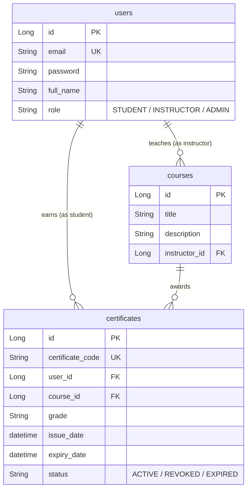
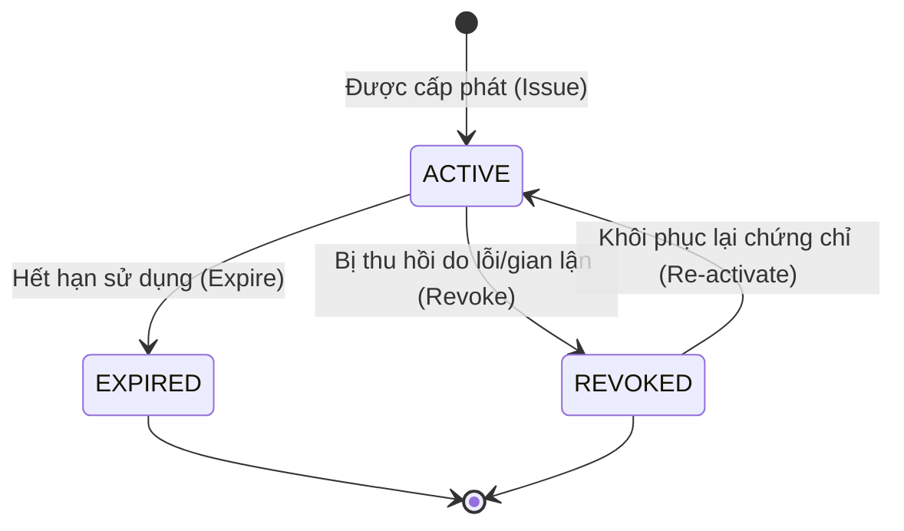

# ĐẶC TẢ YÊU CẦU PHẦN MỀM (SRS) - PHÂN HỆ QUẢN LÝ CHỨNG CHỈ (CERTIFICATE MODULE)
## HỆ THỐNG E-LEARNING (ĐỀ 005)

Tài liệu này đặc tả chi tiết yêu cầu nghiệp vụ và kỹ thuật cho **Phân hệ Quản lý Chứng chỉ (Certificate Management Module)** tích hợp vào hệ thống E-Learning hiện tại. Phân hệ này cung cấp khả năng cấp phát, thu hồi, quản lý và xác thực chứng chỉ hoàn thành khóa học của học sinh.

---

## 1. Nghiệp vụ & Quy tắc Hệ thống (Business Rules)

### 1.1. Quy tắc Cấp phát Chứng chỉ (Issuance Rules)
*   **Điều kiện cấp phát**:
    *   Học viên (`STUDENT`) đã đăng ký học và hoàn thành khóa học (`Course`) theo yêu cầu (ví dụ: hoàn thành toàn bộ bài học hoặc vượt qua điểm số tối thiểu).
    *   Giảng viên (`INSTRUCTOR`) phụ trách khóa học hoặc Quản trị viên (`ADMIN`) có quyền cấp chứng chỉ cho học viên. Giảng viên chỉ được phép cấp chứng chỉ cho khóa học do chính mình giảng dạy.
*   **Tính duy nhất**: Mỗi học viên chỉ có tối đa **một (01)** chứng chỉ hợp lệ (trạng thái `ACTIVE`) cho mỗi khóa học cụ thể.
*   **Mã chứng chỉ (Certificate Code)**: 
    *   Khi cấp phát, hệ thống tự động sinh một mã chứng chỉ duy nhất toàn hệ thống để phục vụ việc tra cứu.
    *   Định dạng đề xuất: `CERT-[UserID]-[CourseID]-[EpochTimestamp]` (Ví dụ: `CERT-15-102-1719878400`).

### 1.2. Quy tắc Thu hồi & Vòng đời Chứng chỉ (Revocation & Lifecycle Rules)
*   **Thu hồi**: Giảng viên phụ trách khóa học hoặc Quản trị viên có quyền thu hồi (`REVOKE`) chứng chỉ đã cấp trong trường hợp phát hiện gian lận học tập hoặc lỗi hành chính.
*   **Hạn dùng**: Chứng chỉ có thể có thời hạn (tính từ ngày cấp đến `expiryDate`) hoặc vô thời hạn (trường `expiryDate` nhận giá trị `NULL`). Khi vượt quá thời gian hiệu lực, trạng thái sẽ tự động chuyển thành hết hạn (`EXPIRED`).
*   **Tra cứu công khai (Public Verification)**: Bất kỳ ai (kể cả khách vãng lai `GUEST` chưa đăng nhập) đều có thể kiểm tra tính hợp lệ của chứng chỉ bằng cách cung cấp mã chứng chỉ (`certificateCode`).

---

## 2. Thiết kế Cơ sở Dữ liệu (Entity & Relationships)

### 2.1. Thiết kế Entity `Certificate`
Thực thể `Certificate` được định nghĩa nhằm lưu trữ thông tin chứng chỉ:

| Thuộc tính (Java Field) | Kiểu dữ liệu | Ràng buộc DB | Mô tả |
| :--- | :--- | :--- | :--- |
| `id` | `Long` | `PRIMARY KEY`, `AUTO_INCREMENT` | ID tự tăng |
| `certificateCode` | `String` | `UNIQUE`, `NOT NULL`, `INDEX` | Mã chứng chỉ duy nhất phục vụ tra cứu công khai |
| `user` | `User` | `FOREIGN KEY` (`user_id`), `NOT NULL` | Học viên nhận chứng chỉ |
| `course` | `Course` | `FOREIGN KEY` (`course_id`), `NOT NULL` | Khóa học tương ứng |
| `grade` | `String` | `NULLABLE` | Xếp loại hoặc điểm số (Ví dụ: "A", "Distinction", "8.5") |
| `issueDate` | `LocalDateTime` | `NOT NULL` | Ngày cấp chứng chỉ |
| `expiryDate` | `LocalDateTime` | `NULLABLE` | Ngày hết hạn chứng chỉ (NULL nếu vô thời hạn) |
| `status` | `String` / `Enum` | `NOT NULL` | Trạng thái: `ACTIVE`, `REVOKED`, `EXPIRED` |

> [!IMPORTANT]
> **Ràng buộc duy nhất (Unique Constraint)**: Cần tạo ràng buộc Unique tổng hợp trên bộ đôi `(user_id, course_id)` để đảm bảo tính duy nhất: Một học viên chỉ có tối đa một chứng chỉ cho một khóa học.

### 2.2. Mối quan hệ với `User` và `Course`
*   **`User` và `Certificate`**: Quan hệ **One-to-Many** (`1-N`). Một `User` (vai trò `STUDENT`) có thể nhận nhiều `Certificate` từ các khóa học khác nhau.
*   **`Course` và `Certificate`**: Quan hệ **One-to-Many** (`1-N`). Một `Course` có thể cấp nhiều `Certificate` cho các học viên khác nhau.
*   **Bảng bắc cầu**: Thực chất `Certificate` đóng vai trò là một bảng liên kết trung gian (chứa thông tin bổ sung) giữa `User` và `Course`.

---

## 3. Lược đồ Quan hệ Thực thể (ERD)

Dưới đây là sơ đồ mối quan hệ giữa `User`, `Course` và `Certificate` dựa trên cấu trúc hiện tại của dự án:



---

## 4. Biểu đồ Chuyển trạng thái Chứng chỉ (State Machine Diagram)

Vòng đời trạng thái của thực thể `Certificate`:



---

## 5. Thuật toán API Tra cứu & Phân trang (Pseudo Code)

### 5.1. Thuật toán Tra cứu chứng chỉ (Search/Filter API)
API này hỗ trợ Admin, Instructor hoặc Student tìm kiếm danh sách chứng chỉ với các tiêu chí lọc: `userId`, `courseId`, `status`. Đồng thời hỗ trợ phân trang và sắp xếp.

```python
FUNCTION searchCertificates(searchParams, pageable):
    # 1. Khởi tạo câu truy vấn động (Specification / QueryBuilder)
    query = QueryBuilder.selectFrom(Certificate)
    
    # 2. Áp dụng bộ lọc nếu có trong searchParams
    IF searchParams.userId IS NOT NULL:
        query.where(Certificate.user.id == searchParams.userId)
        
    IF searchParams.courseId IS NOT NULL:
        query.where(Certificate.course.id == searchParams.courseId)
        
    IF searchParams.status IS NOT NULL:
        query.where(Certificate.status == searchParams.status)
        
    # 3. Phân quyền nghiệp vụ (Business Security Check)
    currentUser = getCurrentAuthenticationUser()
    
    IF currentUser.role == "STUDENT":
        # Học viên chỉ được xem chứng chỉ của chính mình
        query.where(Certificate.user.id == currentUser.id)
        # Chỉ hiển thị chứng chỉ đang hiệu lực (ACTIVE) hoặc đã hết hạn (EXPIRED) cho học viên
        query.where(Certificate.status IN ["ACTIVE", "EXPIRED"])
        
    ELSE IF currentUser.role == "INSTRUCTOR":
        # Giảng viên chỉ xem được chứng chỉ thuộc các khóa học họ dạy
        managedCourseIds = CourseRepository.findIdsByInstructorId(currentUser.id)
        query.where(Certificate.course.id IN managedCourseIds)
        
    # ADMIN có toàn quyền, không cần áp bộ lọc bảo mật bổ sung
    
    # 4. Áp dụng sắp xếp và phân trang
    query.orderBy(pageable.sortColumn, pageable.sortDirection)
    query.limit(pageable.pageSize)
    query.offset(pageable.offset)
    
    # 5. Thực thi và trả về kết quả
    totalElements = query.count()
    content = query.execute()
    
    RETURN PageResponse(content, totalElements, pageable.pageNumber, pageable.pageSize)
```

### 5.2. Thuật toán Xác thực Công khai (Public Verification API)
API dùng để kiểm tra thông tin chứng chỉ thông qua mã code (Không cần đăng nhập).

```python
FUNCTION verifyCertificate(certificateCode):
    # 1. Tìm kiếm chứng chỉ theo mã duy nhất
    certificate = CertificateRepository.findByCertificateCode(certificateCode)
    
    # 2. Nếu không tìm thấy
    IF certificate IS NULL:
        THROW BusinessException(404, "Certificate not found or invalid code.")
        
    # 3. Nếu tìm thấy, kiểm tra hạn dùng để cập nhật động (nếu cần)
    IF certificate.status == "ACTIVE" AND certificate.expiryDate IS NOT NULL:
        IF currentDate() > certificate.expiryDate:
            certificate.status = "EXPIRED"
            CertificateRepository.save(certificate)
            
    # 4. Trả về DTO chứa thông tin công khai (ẩn đi các thông tin nhạy cảm của User)
    RETURN PublicCertificateDTO(
        certificateCode = certificate.certificateCode,
        studentName = certificate.user.fullName,
        courseTitle = certificate.course.title,
        issueDate = certificate.issueDate,
        expiryDate = certificate.expiryDate,
        grade = certificate.grade,
        status = certificate.status
    )
```

---

## 6. Ma trận Phân quyền API (Authorization Matrix)

Hệ thống phân quyền dựa trên 4 vai trò người dùng tương tác với API Chứng chỉ:

| API Endpoint | Phương thức | GUEST | STUDENT | INSTRUCTOR | ADMIN |
| :--- | :--- | :---: | :---: | :---: | :---: |
| `/api/certificates/verify/{code}` | `GET` | **Cho phép** | **Cho phép** | **Cho phép** | **Cho phép** |
| `/api/certificates/my` | `GET` | Từ chối | **Cho phép** (Chỉ xem của mình) | Từ chối | Từ chối |
| `/api/certificates` (Lọc/Phân trang) | `GET` | Từ chối | **Cho phép** (Tự lọc về của mình) | **Cho phép** (Khóa học phụ trách) | **Cho phép** (Toàn bộ) |
| `/api/certificates/{id}` (Chi tiết) | `GET` | Từ chối | **Cho phép** (Nếu là chủ sở hữu) | **Cho phép** (Nếu dạy khóa này) | **Cho phép** |
| `/api/certificates` (Cấp mới) | `POST` | Từ chối | Từ chối | **Cho phép** (Khóa học phụ trách) | **Cho phép** |
| `/api/certificates/{id}/revoke` | `PATCH` | Từ chối | Từ chối | **Cho phép** (Khóa học phụ trách) | **Cho phép** |

---

## 7. Danh sách tài liệu API chi tiết (API Documentation Spec)

*Lưu ý: Để khớp với yêu cầu Đề 005, dữ liệu truyền nhận JSON sử dụng định dạng `snake_case`.*

### 7.1. Cấp phát chứng chỉ mới (Issue Certificate)
*   **Path**: `POST /api/certificates`
*   **Quyền truy cập**: `INSTRUCTOR`, `ADMIN`
*   **Yêu cầu Request Body (JSON)**:
    ```json
    {
      "user_id": 15,
      "course_id": 102,
      "grade": "Excellent",
      "expiry_days": 365
    }
    ```
*   **Mô tả phản hồi thành công (201 Created)**:
    ```json
    {
      "code": 201,
      "message": "Certificate issued successfully",
      "data": {
        "id": 1,
        "certificate_code": "CERT-15-102-1719878400",
        "student_name": "Nguyen Van A",
        "course_title": "Java Spring Boot Core",
        "grade": "Excellent",
        "issue_date": "2026-07-08T13:20:00",
        "expiry_date": "2027-07-08T13:20:00",
        "status": "ACTIVE"
      }
    }
    ```

### 7.2. Tra cứu chứng chỉ công khai (Verify Certificate)
*   **Path**: `GET /api/certificates/verify/{certificate_code}`
*   **Quyền truy cập**: `Public (GUEST)` (Không yêu cầu JWT token)
*   **Mô tả phản hồi thành công (200 OK)**:
    ```json
    {
      "code": 200,
      "message": "Certificate verified",
      "data": {
        "certificate_code": "CERT-15-102-1719878400",
        "student_name": "Nguyen Van A",
        "course_title": "Java Spring Boot Core",
        "grade": "Excellent",
        "issue_date": "2026-07-08T13:20:00",
        "expiry_date": "2027-07-08T13:20:00",
        "status": "ACTIVE"
      }
    }
    ```

### 7.3. Thu hồi chứng chỉ (Revoke Certificate)
*   **Path**: `PATCH /api/certificates/{id}/revoke`
*   **Quyền truy cập**: `INSTRUCTOR`, `ADMIN`
*   **Mô tả phản hồi thành công (200 OK)**:
    ```json
    {
      "code": 200,
      "message": "Certificate has been successfully revoked",
      "data": {
        "id": 1,
        "certificate_code": "CERT-15-102-1719878400",
        "status": "REVOKED"
      }
    }
    ```

### 7.4. Xem danh sách chứng chỉ cá nhân của học sinh (Get My Certificates)
*   **Path**: `GET /api/certificates/my`
*   **Quyền truy cập**: `STUDENT` (Tự động lấy ID người dùng từ JWT Token)
*   **Mô tả phản hồi thành công (200 OK)**:
    ```json
    {
      "code": 200,
      "message": "Fetched my certificates successfully",
      "data": [
        {
          "id": 1,
          "certificate_code": "CERT-15-102-1719878400",
          "course_title": "Java Spring Boot Core",
          "grade": "Excellent",
          "issue_date": "2026-07-08T13:20:00",
          "expiry_date": "2027-07-08T13:20:00",
          "status": "ACTIVE"
        }
      ]
    }
    ```

### 7.5. Tìm kiếm/Lọc chứng chỉ nâng cao (Search Certificates)
*   **Path**: `GET /api/certificates`
*   **Quyền truy cập**: `STUDENT`, `INSTRUCTOR`, `ADMIN`
*   **Query Params**:
    *   `user_id` (Lọc theo học sinh)
    *   `course_id` (Lọc theo khóa học)
    *   `status` (Lọc theo trạng thái `ACTIVE` / `REVOKED` / `EXPIRED`)
    *   `page` (Số trang, mặc định `0`)
    *   `size` (Kích thước trang, mặc định `10`)
    *   `sort_by` (Trường sắp xếp, mặc định `issueDate`)
    *   `sort_dir` (Hướng sắp xếp, mặc định `desc`)
*   **Mô tả phản hồi thành công (200 OK)**:
    ```json
    {
      "code": 200,
      "message": "Fetched certificates page successfully",
      "data": {
        "content": [
          {
            "id": 1,
            "certificate_code": "CERT-15-102-1719878400",
            "student_name": "Nguyen Van A",
            "course_title": "Java Spring Boot Core",
            "grade": "Excellent",
            "issue_date": "2026-07-08T13:20:00",
            "expiry_date": "2027-07-08T13:20:00",
            "status": "ACTIVE"
          }
        ],
        "total_elements": 1,
        "page_number": 0,
        "page_size": 10,
        "total_pages": 1
      }
    }
    ```
